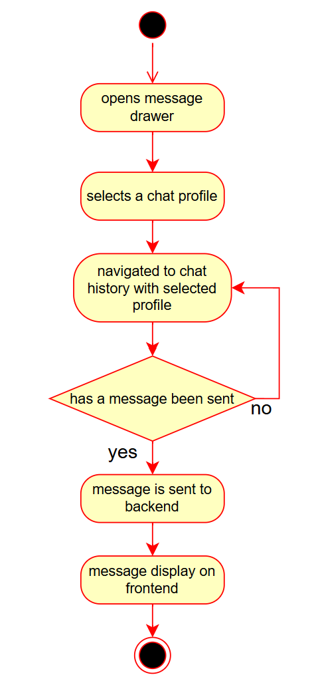

# Developer Guide for Peng

# Architecture
** will be included soon!!

# Components  

| Component    | Description |
| -------- | ------- |
| WelcomePage  | Main entry point of the website. Has 2 buttons, ‘login’ and ‘create account’, which navigates the user to the Login and CreateAccount components respectively    |
| Login | Includes a form, with client-side and server-side validations, that a user must fill up in order to login. Sends username and password to server for verification. If authenticated, a JWT is issued and stored inside the user’s localStorage, giving the user access to subsequent pages. Navigated to the People page after successful login. |
| CreateAccount | Includes a form, with client-side and server-side validations, that a user must fill up in order to create an account. Fields are controlled. Sends user credentials (firstName, lastName, username, password) to server for verification. If authenticated (i.e., username does not exist in the database yet), a JWT is issued and stored inside the user’s localStorage, giving the user access to subsequent pages. Navigated to the FillBio page after successful account creation. |
| FillBio  | Includes a single textField for the user to write a short description about herself. Sends the contents of the textField and the currently logged in user object to the server for database table update. Navigated to the Hobbies page after clicking next. |
| Hobbies  | Users must select 3 hobbies out of the list of hobbies displayed. Includes client-side validation and helper texts to ensure users are aware of what to do at this step. Sends the list of hobbies and the currently logged in user object to the server for database table update. Navigated to the Hobbies page after clicking next. |
| AddImages | Includes a button for the user to select 3 images from file explorer. Includes a Material UI’s ImageList to display the images. Sends the URLs of the images to the server for upload. |
| People | An explore page where users look at other users’ profiles. Child components include MatchModal, ProfileCard, ProfileDrawer, and MessagesDrawer. |
| MatchModal  | If 2 users liked each other, this modal will open and notify the user that there is a match. The user can choose either to send a message to the user she just matched with or close the modal. Clicking on the ‘send message’ button will navigate the user to the Messages page. |
| MessagesDrawer  | Opens up a drawer anchored to the right, that displays the users whom the currently logged in user had already matched with. Displays the users as a list. UserProfile is a child component. |
| UserProfile | Each matched user in Messages is mapped to a UserProfile component. It displays the user’s username and an avatar with the first letter of the username as the avatar logo. The color of the avatar is also randomly chosen. |
| Messages | Displays the messages (chat history) the currently logged in user has with another user. MessagesBubble is a child component. |
| MessageBubble  | The content of a message sent is mapped to a custom styled Material UI Box component. The message is displayed in the shape of a bubble. |
| ProfileDrawer  | Opens up a drawer anchored to the left, that displays the details of the currently logged in user. The user can view her own account details (firstName, lastName, username, bio, hobbies). A logout button is present for the user to log out. The user will be navigated to the Logout page. ProfileSection is a child component. |
| ProfileSection | Each detail of the user’s account is mapped to a custom styled Material UI Stack, which displays the title (eg. username) and the content. |
| ProfileCard | Displays each user in the database as a card in the People page. Displays the account’s firstName, lastName, bio, hobbies and uploaded images. Each card has a like and pass button, which upon pressing will simulate the swipe feature commonly seen in dating apps. |
| LogOut  | Displays the logout page. Contains a button, which upon clicking will navigate the user back to the Welcome page. |
| Review | Displays some of the latest user reviews in the Welcome page. |
| UserContext  | Creates a global currentUser variable that is set to the currently logged in user. |

# Implementation
This section describes some noteworthy details on how certain features were implemented.

## Login
This section shows the Login component and its dependencies in detail.  
When the user clicks the login button, on the frontend, the form first checks if both fields have been filled up.  
The form then checks if the password is correct.  
Helper texts will be displayed by the form if the username is missing, password is missing, or if the password
is incorrect.  

  

The following shows an activity diagram, which describes the flow of events when a user logs in.  

  

## Adding/Uploading Image
This section shows the AddImage component and its dependencies in detail.  
When the user uploads images from its local file explorer, a URL is created for each image to display them.  
After the user clicks on the next button, the URLs of the 3 selected images are sent to Cloudinary for storage.  
Subsequent use of these images will fetch it from Cloudinary.  

The following shows an activity diagram, which describes the flow of events when a user uploads an image.  

## Match

The following shows an activity diagram, which describes the flow of events when a user has a match.  

## Message
This section shows the Messages component and its dependencies in detail.  

  

The following shows an activity diagram, which describes the flow of events when a user sends a message.  

  

## Other
Peng was started as a passion project to learn more about ReactJS, Express.JS and mainly Sqlite3. I wanted to learn more about working with an actual database (my previous projects used json files as a database :/) and learning how to interact with it. I ended up leanring so much more through Peng, from creating protected routes using JWT (JSON Web Tokens) for authentication, creating RESTful APIs to interact with Cloudinary for images, and creating server endpoints for debugging.  

Peng definitely has a lot of room for improvement (**cough cough) such as UI/UX aspects and I may have missed out some bugs during development, so please don't take it too seriously and start roasting Peng. However, it was a fun journey and I hope you will enjoy it :) 