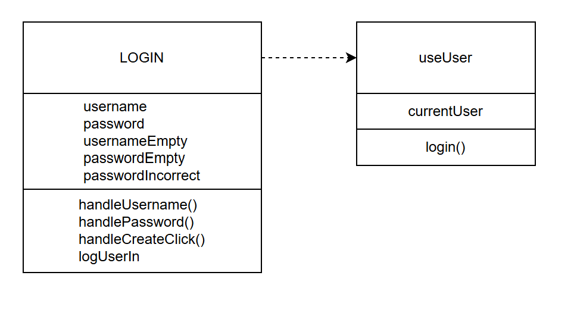
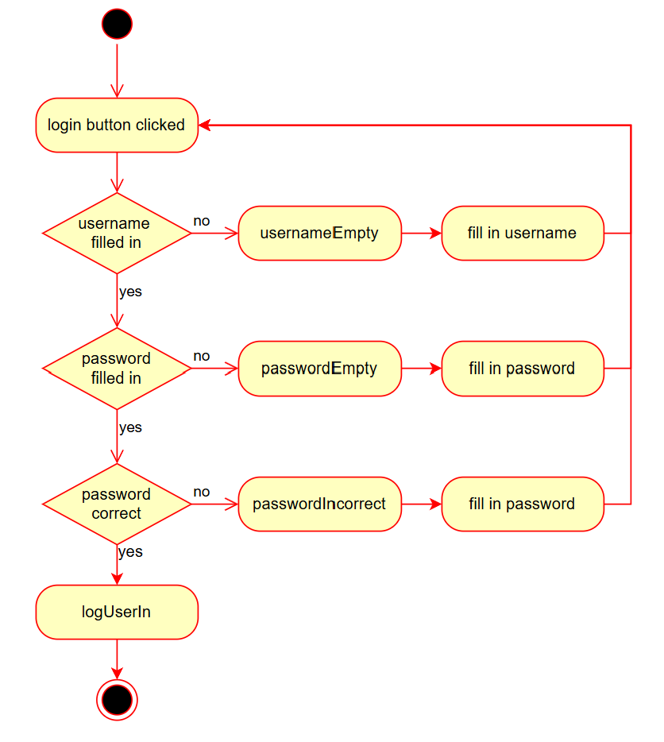
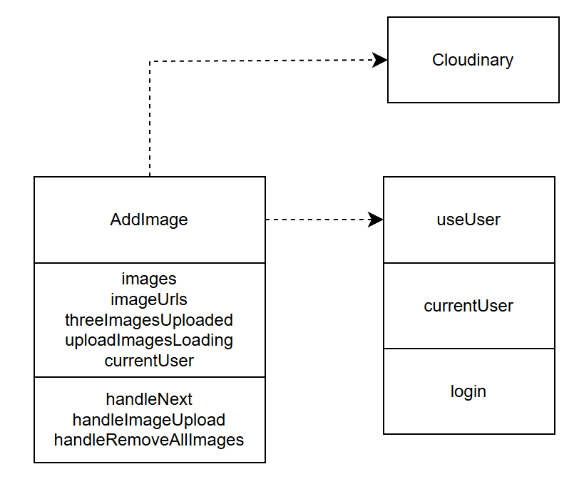
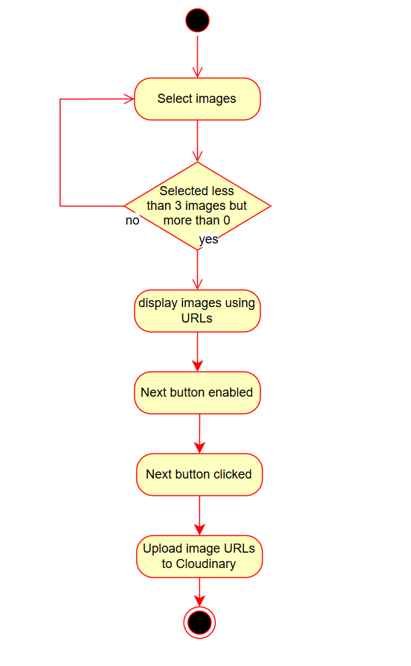
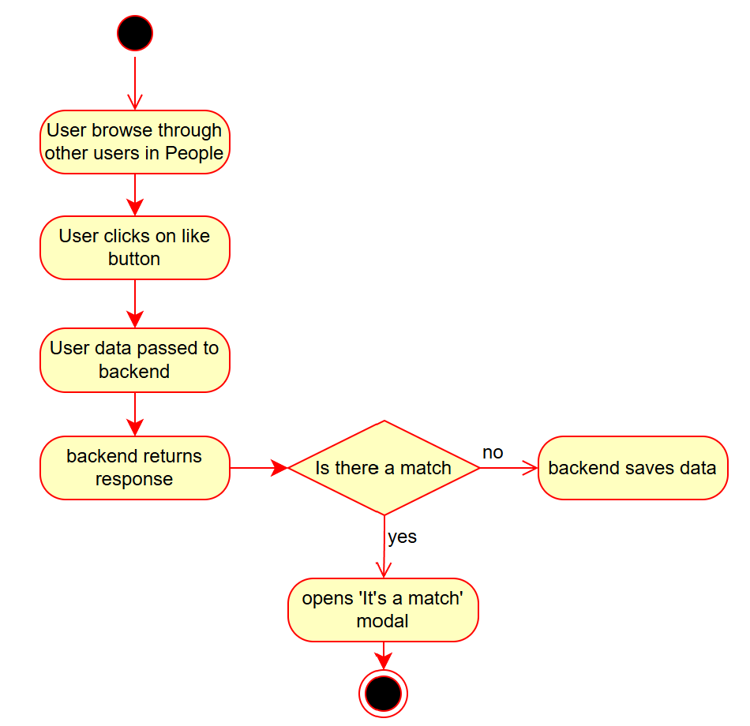
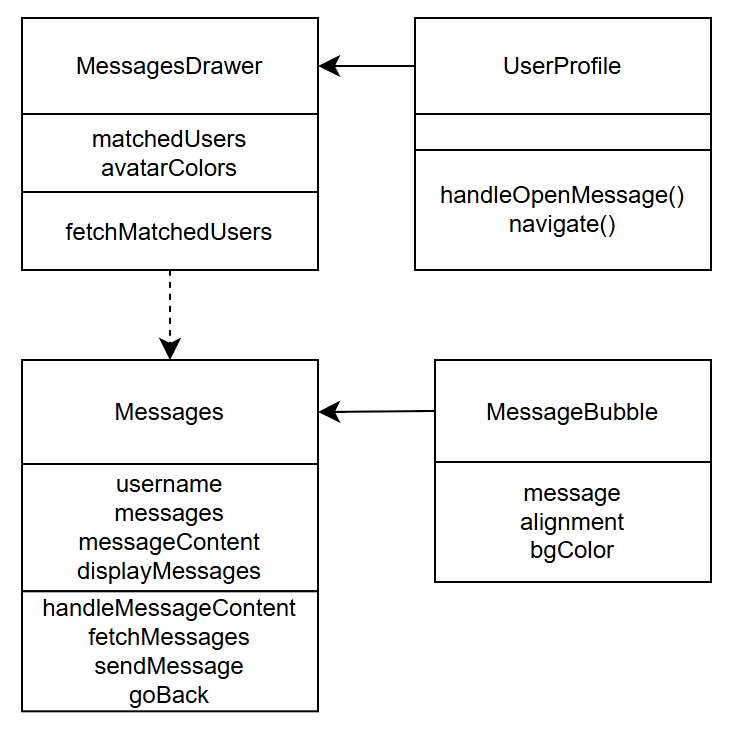
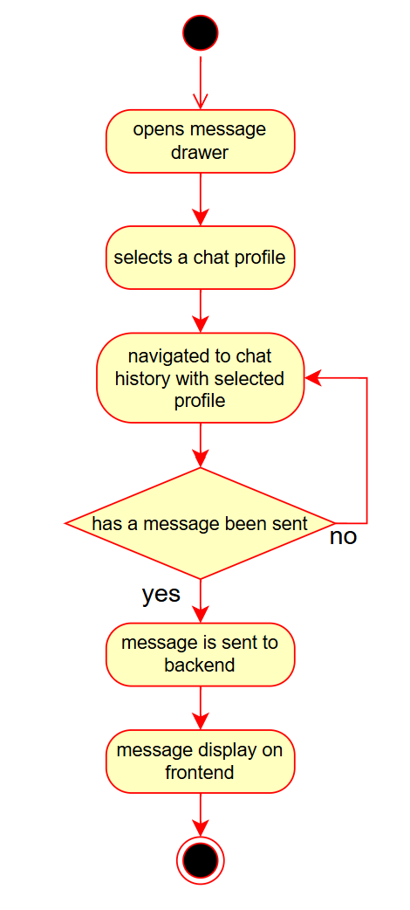

# Developer Guide for Peng

# Architecture

# Components

# Implementation
This section describes some noteworthy details on how certain features were implemented.

## Login
This section shows the Login component and its dependencies in detail.  
When the user clicks the login button, on the frontend, the form first checks if both fields have been filled up.  
The form then checks if the password is correct.  
Helper texts will be displayed by the form if the username is missing, password is missing, or if the password
is incorrect.  

  

The following shows an activity diagram, which describes the flow of events when a user logs in.  

  

## Adding/Uploading Image
This section shows the AddImage component and its dependencies in detail.  
When the user uploads images from its local file explorer, a URL is created for each image to display them.  
After the user clicks on the next button, the URLs of the 3 selected images are sent to Cloudinary for storage.  
Subsequent use of these images will fetch it from Cloudinary.  

The following shows an activity diagram, which describes the flow of events when a user uploads an image.  

## Match

The following shows an activity diagram, which describes the flow of events when a user has a match.  

## Message
This section shows the Messages component and its dependencies in detail.  

  

The following shows an activity diagram, which describes the flow of events when a user sends a message.  

  
